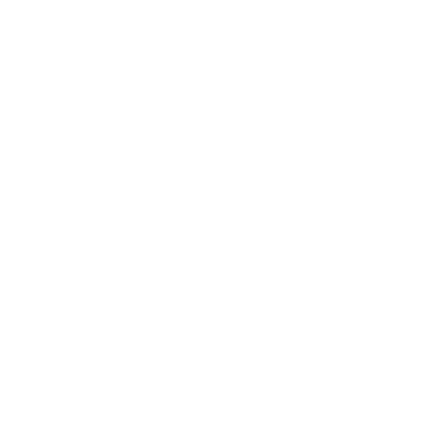

<a name="readme-top"></a>

[](https://github.com/aubravo/earthgazer/graphs/contributors)
[](https://github.com/aubravo/earthgazer/network/members)
[](https://github.com/aubravo/earthgazer/stargazers)
[](https://github.com/aubravo/earthgazer/issues)
[](https://github.com/aubravo/earthgazer/blob/master/LICENSE.txt)
[](https://github.com/aubravo/earthgazer/actions/workflows/docker-publish.yml)

<div>
<br />
<p align="center">
<a href="https://github.com/aubravo/earthgazer"></a>
<p align="center">
This library manages the data pipeline and infrastructure for image inputs, handle and pre-process them, to prepare
for the machine learning training and testing processes.
<br />
This project is licensed with GPL-3.0-or-later.
<br />
If you are interested in participating, please feel free to contribute.
<br />
<a href="https://github.com/aubravo/earthgazer"><strong>Explore the docs »</strong></a>
<br />
<br />
<a href="https://github.com/aubravo/earthgazer/issues">Report Bug</a>
·
<a href="https://github.com/aubravo/earthgazer/issues">Request Feature</a>
</p>
</div>

## Contents
<!-- TOC -->
  * [Contents](#contents)
  * [About The Project](#about-the-project)
    * [Built With](#built-with)
  * [Getting Started](#getting-started)
    * [Prerequisites](#prerequisites)
    * [Installation](#installation)
  * [Useful commands](#useful-commands)
  * [Roadmap](#roadmap)
  * [Contributing](#contributing)
  * [License](#license)
  * [Contact](#contact)
  * [Acknowledgments](#acknowledgments)
<!-- TOC --> 

## About The Project

This project started as part of [Alvaro Bravo](mailto:alvaroubravo@gmail.com)'s Master's thesis as a way to
develop the capability of segregating volcanic emissions from clouds in satellite images in RGB, by training a CNN
with images from Sentinel and Landsat missions which offer hyperspectral data that allows the labelling of data for
training the neural network. Even though, the target of the project is the Popocatépetl volcano, it's built in such
a way as to allow the use of the infrastructure to explore and handle satellite images from different sources and
locations.

### Built With

[](https://python.org)
[](https://kubernetes.io)
[](https://docker.com)
[](https://cloud.google.com)
[](https://tensorflow.org)

## Getting Started

### Prerequisites

> IMPORTANT: The data handling side of the project **REQUIRES AT LEAST PYTHON 3.11 TO RUN.** due to collections.abc changes required for the implemented protocols. 

To get started, you will need a **Google Console account** setup and meet the following requirements:
- a [GCP bucket](https://cloud.google.com/storage/docs/creating-buckets) setup for the project.
- [_gsutil_](https://cloud.google.com/storage/docs/gsutil_install) and [_gcloud_](https://cloud.google.com/sdk/docs/install) installed on your machine
- a [service account](https://cloud.google.com/iam/docs/creating-managing-service-accounts) with at least the following roles:
  - bigquery.user
  - storage.objectAdmin (for security, only allow the service account access to the project bucket)
- **OPTIONAL:** a [GKE cluster](https://cloud.google.com/kubernetes-engine/docs/deploy-app-cluster) if you are interested on running your application on Kubernetes.
- **OPTIONAL:** a Database setup for a production database setup.

### Installation 

If you are interested on running the application locally:
```commandline
git clone https://github.com/aubravo/earthgazer
```
and get your service account keys into the project folder by running:
```commandline
gcloud iam service-accounts keys create keys.json --iam-account=your-service-account
```
if you are interested on running the application on kubernetes, both `kubectl` and a project database are required.
Once your cluster is set up and is accessible by kubectl, it is recommended to pass the database connection requirements
as a cluster secret, as well as the contents of the service account. For example:

## Useful Commands

<!-- TODO: Add Useful commands -->

## Roadmap
See the [open issues](https://github.com/aubravo/earthgazer/issues) for a full list of proposed features (and known issues).

## Contributing
Contributions are what make the open source community such an amazing place to learn, inspire, and create. Any contributions you make are **greatly appreciated**.

If you have a suggestion that would make this better, please fork the repo and create a pull request. You can also simply open an issue with the tag "enhancement".
Don't forget to give the project a star! Thanks again!

## License
Distributed under the MIT License. See `LICENSE` doc for more information.


## Contact
Alvaro U. Bravo - [alvaroubravo@gmail.com](mailto:alvaroubravo@gmail.com); [alvaroulises.bravo@upaep.edu.mx](mailto:alvaroulises.bravo@upaep.edu.mx)

Project Links:
* [earthgazer - GitHub](https://github.com/aubravo/earthgazer)
* [earthgazer - UPAEP](https://upaep.mx/gxiba/)

## Acknowledgments

* [UPAEP](https://upaep.mx/)
* [CONACYT](https://conacyt.mx/)
* [Agencia Espacial Mexicana](https://www.gob.mx/aem)

<p align="right">(<a href="#readme-top">back to top</a>)</p>
