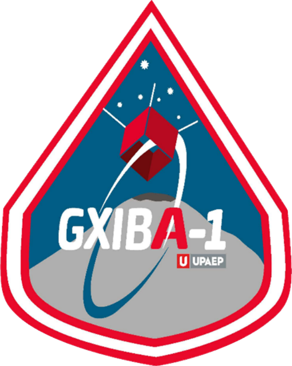

<a name="readme-top"></a>

<div align="center">

[![Contributors][contributors-shield]][contributors-url]
[![Forks][forks-shield]][forks-url]
[![Stargazers][stars-shield]][stars-url]
[![Issues][issues-shield]][issues-url]
[![MIT License][license-shield]][license-url]

</div>


<!-- PROJECT LOGO -->
<br />
<div align="center">
  <a href="https://github.com/aubravo/gxiba">
    
  </a>

<h1 align="center">Gxiba</h1>

  <p align="center">
'Gxiba' stands for 'sky' or 'universe' in Zapoteco language. It is also the name of the second satellite mission to be launched by UPAEP.

I developed this library as part of my Data Science and Business Intelligence master's degree thesis. It contains and merges all the data pipeline and data science methods used to build the volcanic ash detection capability for the Gxiba-1 and Gxiba-2 missions.

It is structured in such a way that can allow to build upon further functionalities. If you are interested in participating, please feel free to contribute.
    <br />
    <a href="https://github.com/aubravo/gxiba"><strong>Explore the docs »</strong></a>
    <br />
    <br />
    <a href="https://github.com/aubravo/gxiba/issues">Report Bug</a>
    ·
    <a href="https://github.com/aubravo/gxiba/issues">Request Feature</a>
  </p>
</div>


<!-- TABLE OF CONTENTS -->
<details>
  <summary>Table of Contents</summary>
  <ol>
    <li>
      <a href="#about-the-project">About The Project</a>
      <ul>
        <li><a href="#built-with">Built With</a></li>
      </ul>
    </li>
    <li>
      <a href="#getting-started">Getting Started</a>
      <ul>
        <li><a href="#prerequisites">Prerequisites</a></li>
        <li><a href="#installation">Installation</a></li>
      </ul>
    </li>
    <li><a href="#usage">Usage</a></li>
    <li><a href="#roadmap">Roadmap</a></li>
    <li><a href="#contributing">Contributing</a></li>
    <li><a href="#license">License</a></li>
    <li><a href="#contact">Contact</a></li>
    <li><a href="#acknowledgments">Acknowledgments</a></li>
  </ol>
</details>


<!-- ABOUT THE PROJECT -->
## About The Project

To Do

<p align="right">(<a href="#readme-top">back to top</a>)</p>


### Built With

[![Python][Python.org]][Python-url]
[![Kubernetes][Kubernetes.io]][Kubernetes-url]
[![Docker][Docker.com]][Docker-url]
[![Google Cloud][cloud.google.com]][cloud-url]
[![Apache Spark][spark.apache.org]][spark-url]

<p align="right">(<a href="#readme-top">back to top</a>)</p>


<!-- GETTING STARTED -->
## Getting Started

To-Do 

### Prerequisites

To-Do

### Installation

To-Do

<p align="right">(<a href="#readme-top">back to top</a>)</p>

<!-- USAGE EXAMPLES -->
## Usage

To-Do

### Useful commands: ###

```commandline
helm install postgres bitnami/postgresql
```
To get the password for "postgres" run:
```commandline
export POSTGRES_PASSWORD=$(kubectl get secret gxiba-postgresql -o jsonpath="{.data.postgres-password}" | base64 -d)
```

<!-- ROADMAP -->
## Roadmap

To-Do

See the [open issues](https://github.com/aubravo/gxiba/issues) for a full list of proposed features (and known issues).

<p align="right">(<a href="#readme-top">back to top</a>)</p>


<!-- CONTRIBUTING -->
## Contributing

Contributions are what make the open source community such an amazing place to learn, inspire, and create. Any contributions you make are **greatly appreciated**.

If you have a suggestion that would make this better, please fork the repo and create a pull request. You can also simply open an issue with the tag "enhancement".
Don't forget to give the project a star! Thanks again!

1. Fork the Project
2. Create your Feature Branch (`git checkout -b feature/AmazingFeature`)
3. Commit your Changes (`git commit -m 'Add some AmazingFeature'`)
4. Push to the Branch (`git push origin feature/AmazingFeature`)
5. Open a Pull Request

<p align="right">(<a href="#readme-top">back to top</a>)</p>


<!-- LICENSE -->
## License

Distributed under the MIT License. See `LICENSE.txt` for more information.

<p align="right">(<a href="#readme-top">back to top</a>)</p>


<!-- CONTACT -->
## Contact

Alvaro U. Bravo - [alvaroubravo@gmail.com](mailto:alvaroubravo@gmail.com); [alvaroulises.bravo@upaep.edu.mx](mailto:alvaroulises.bravo@upaep.edu.mx)

Project Links:
* [Gxiba - GitHub](https://github.com/aubravo/gxiba)
* [Gxiba - UPAEP](https://upaep.mx/gxiba/)
<p align="right">(<a href="#readme-top">back to top</a>)</p>


<!-- ACKNOWLEDGMENTS -->
## Acknowledgments

* []()
* []()
* []()

<p align="right">(<a href="#readme-top">back to top</a>)</p>


<!-- MARKDOWN LINKS & IMAGES -->
<!-- https://www.markdownguide.org/basic-syntax/#reference-style-links -->
[contributors-shield]: https://img.shields.io/github/contributors/aubravo/gxiba.svg?style=for-the-badge
[contributors-url]: https://github.com/aubravo/gxiba/graphs/contributors
[forks-shield]: https://img.shields.io/github/forks/aubravo/gxiba.svg?style=for-the-badge
[forks-url]: https://github.com/aubravo/gxiba/network/members
[stars-shield]: https://img.shields.io/github/stars/aubravo/gxiba.svg?style=for-the-badge
[stars-url]: https://github.com/aubravo/gxiba/stargazers
[issues-shield]: https://img.shields.io/github/issues/aubravo/gxiba.svg?style=for-the-badge
[issues-url]: https://github.com/aubravo/gxiba/issues
[license-shield]: https://img.shields.io/github/license/aubravo/gxiba.svg?style=for-the-badge
[license-url]: https://github.com/aubravo/gxiba/blob/master/LICENSE.txt
[Python.org]: https://img.shields.io/badge/Python-3.8-4B8BBE?style=for-the-badge&logo=Python&logoColor=4B8BBE
[Python-url]: https://python.org 
[Kubernetes.io]: https://img.shields.io/badge/Kubernetes-326ce5?style=for-the-badge&logo=Kubernetes&logoColor=white
[Kubernetes-url]: https://kubernetes.io
[Docker.com]: https://img.shields.io/badge/Docker-0db7ed?style=for-the-badge&logo=Docker&logoColor=white
[Docker-url]: https://docker.com
[cloud.google.com]: https://img.shields.io/badge/Google_Cloud-DB4437?style=for-the-badge&logo=GoogleCloud&logoColor=F4B400
[cloud-url]: https://cloud.google.com
[spark.apache.org]: https://img.shields.io/badge/Apache_Spark-white?style=for-the-badge&logo=ApacheSpark&logoColor=E25A1C
[spark-url]: https://spark.apache.org
